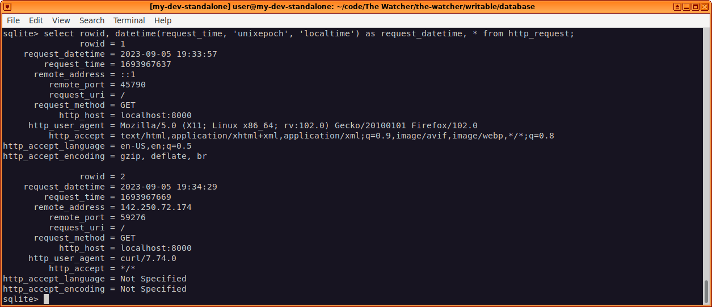
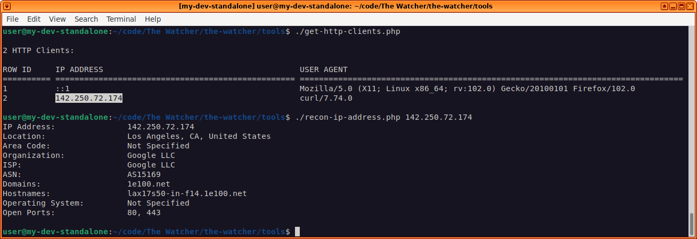

# The Watcher

Author: Daniel Gilbert (AdaptOrDie247)

A honeypot that logs traffic, with accompanying tools to analyze HTTP clients as well as perform passive recon on the client hosts.

## WARNING

If you make this application public-facing, make sure you know what you're doing.

Insecure deployment of the application can result in a system compromise, or worse.

## Quick Setup

1.  Install system dependencies: PHP, SQLite3.
2.  Git clone the repo.
3.  Install and run Composer to install the project dependencies.
4.  Create a `.env` file in the project root with the following values:
-   `database.directory`: The database directory. E.g., `writable/database`.
-   `database.name`: The database name. E.g., `the_watcher.db`.
-   `shodan.api_key`: A valid Shodan API key if you want to use the recon tools.
5.  Open a terminal in the `public` directory.
6.  Start the PHP web server: `php -S localhost:8000`.
7.  Navigate to `localhost:8000` in a web browser to log the request.
8.  Open a terminal in the `tools` directory.
9.  List the HTTP clients: `./get-http-clients.php`.
10. Perform passive recon on an IP address: `./recon-ip-address.php IP_ADDRESS`.
